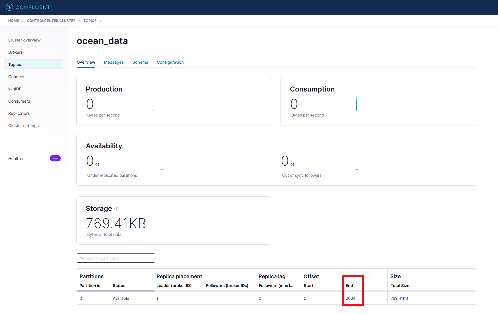

# Kafka Visualization

This is a repository to highlight the simplicity of deploying your own Kafka cluster, as well as your own Apache Druid and Apache Superset, to highlight the combination of streaming and visualization capabilities that are possible.

## Background

Kafka, Druid and Superset as a combination allows for visualizations on top of queryable data streams. Connecting the components allow for strong visualizations that can help drive business insights. The usage of this repository is to deploy the three tech components using Docker-compose, and have them auto-configured such that you can simply use Apache Superset to view visualizations.

Scroll down to the usage section below to deploy the server components and load up the data and visualizations of this repository.

## Prerequisites

* Docker version 1.11 or later is installed and running.
* Docker Compose is installed. Docker Compose is installed by default with Docker for Mac and Docker for Windows.
* Internet connectivity
* Networking and Kafka on Docker
* Install curl (optional)
* MapBox account & API key; please substitute this in at line 48 of docker/superset/superset-env file to set *MAPBOX_API_KEY*

## Install

Please ensure you have all of the pre-requisites. If you are unable to run Docker on your machine with network connectivity, you will run into issues on these commands. These commands have been tested against Ubuntu on WSL2 and EC2.

### Deploy the Services

This step requires you to leverage docker-compose, similarly:

```
./kafka-visualizer.sh setup
```

## Usage

### Infrastructure Deployment

To start the Kafka visualizer, run the following command:

```
./kafka-visualizer.sh start
```

Please give this about 2 minutes to load. This will take care of the following automations:

1. Deployment of Kafka cluster, Druid cluster, as well as the Superset cluster
2. Creation of the Kafka cluster topics as a Docker job
3. Uploading of the Day1 JSON into the Kafka topic
4. Configuration of Druid to Supervise the ocean_data topic as a Docker job
5. Auto-configuration of Apache Superset to reference MapBox API

The URLs to access are as follows:

* http://localhost:9021/clusters for Kafka
* http://localhost:8888/unified-console.html# for Druid
* http://localhost:8088/login/ for Superset

You can check the status such as:

```
./kafka-visualizer.sh status
```

**NOTE: There is a race condition on the deployment of superset that results in corrupt database files. You will know this has happened when you have an HTTP500 on Superset login page. Not sure of the root cause, there's reported issues on it such as @ https://github.com/apache/superset/issues/14329. Did not get much time to dig in.**

Once the commands run and all is setup, we will need to create the database, dataset and charts within Superset.

### Configuration of Apache Superset

Login credentials are default, admin/admin. 


Create a database with the following parameters, using *druid://druid-broker:8082/druid/v2/sql* as the host:


Now go to Data -> Datasets, and create a dataset.


Go to Charts, and create new chart. We select MapBox to take advantage of the Longtitude / Latitude coordinates. Hit create:


We correct the attributes for latitude and longtitude, and observe a map is created with coordinates:


Note the # of records that are cited (~2000)

### Validation

First, let's confirm the # of records we have from Day 1.

#### Druid Validation

Navigate to druid @ http://localhost:8888/unified-console.html#query

You can run the following query:

```
SELECT
  COUNT(*) AS "Count"
FROM ocean_data
```

You should see:


#### Kafka Validation

Navigate to kafka @ topics and make note of the last offset:



### Upload Day 2 Data

Run the utility to upload day 2 data:

```
./kafka-visualizer.sh upload data/day2.json
```

You should see a number of messages suggesting the data was uploaded to the kafka topic.

#### Kafka Confirmation

We should see the index offsets increase about ~2x, similarly:


#### Druid Confirmation

We should be able to run the same query, and confirm the increase in messages:


#### Superset Confirmation

This piece is TBD!

## Cleanup

```
./kafka-visualizer.sh stop
```

## Future Features for Consideration

1. The deployment and seeding of Kafka topics is time based, it could raise a race condition. In future we should move these to readiness checks to ensure the clusters are available, and create them as required.
2. Superset auto-refreshing of dashboard and data.
3. Reduction of unused components, not all components are used here and this can be taxing on a single server.
4. Actual analytics on the data - the data itself is interesting and probably very useful, so we can demonstrate some very impactful insights from this data. Pairing that with additional views of Superset.
5. Proper instantiation of Superset - once the dashboard is created, I would want to setup an init container to configure Superset to have this automatically loaded, to ensure auto-deployments.
6. Unit tests!
7. SSL errors on the upload utility require certs